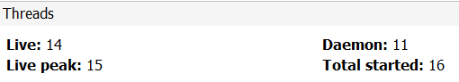
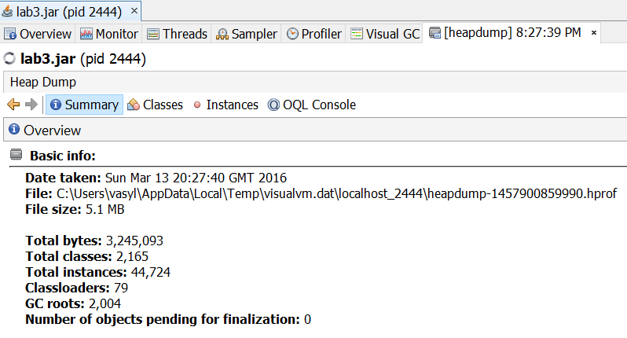
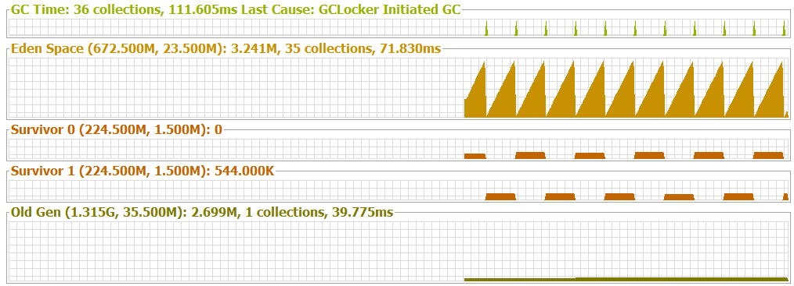
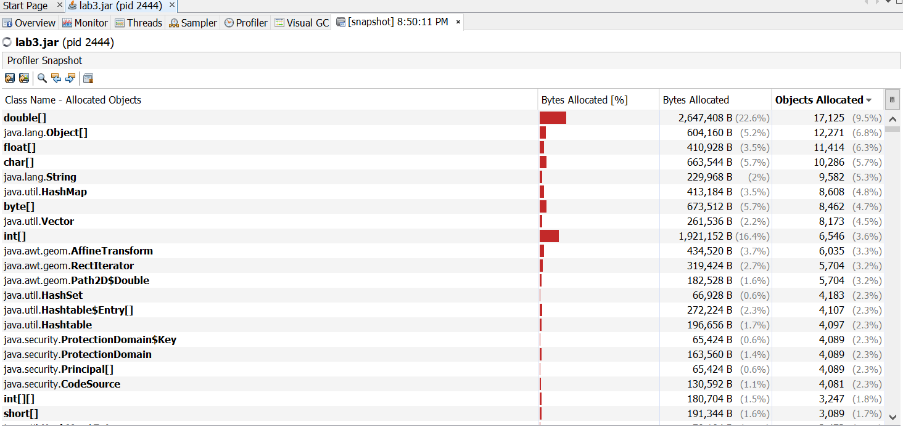
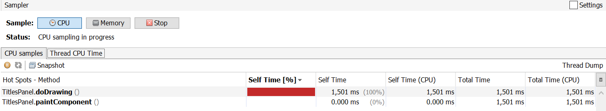

# Профилирование

## Анализ приложения с использованием Java VisualVM

Запущенно всего 16 потоков, в момент снятия скришнота
работающих(живых) всего 14, а максимальное число таких
потоков достигало 15. При этом 11 потоков запущенны в
фоновом режиме. 



Большинство потоков создано для поддержания работоспособности
графического интерфейса, уборки мусора и т.д.

Само же полезное действие программы выполняется в одном потоке **AWT-EventQueue-0**:
```
Threads at the heap dump:
-------------------------
  
"AWT-EventQueue-0" prio=6 tid=13 WAITING

"DestroyJavaVM" prio=5 tid=14 RUNNABLE
  
"TimerQueue" daemon prio=5 tid=15 TIMED_WAITING
  
"RMI TCP Accept-0" daemon prio=5 tid=18 RUNNABLE
  
"AWT-Shutdown" prio=5 tid=10 WAITING
  
"Java2D Disposer" daemon prio=10 tid=9 WAITING
  
"AWT-Windows" daemon prio=6 tid=11 RUNNABLE
  
"Attach Listener" daemon prio=5 tid=5 RUNNABLE
  
"JMX server connection timeout 21" daemon prio=5 tid=21 TIMED_WAITING
  
"Signal Dispatcher" daemon prio=9 tid=4 RUNNABLE
  
"RMI TCP Connection(2)-192.168.99.1" daemon prio=5 tid=22 RUNNABLE
  
"Reference Handler" daemon prio=10 tid=2 WAITING
  
"RMI Scheduler(0)" daemon prio=5 tid=20 TIMED_WAITING
  
"Finalizer" daemon prio=8 tid=3 WAITING
```



Как видим, максимальный размер Eden Space 672.5Мб, текущий размер 23.5Мб,
и в момент снятия скриншота занято было лишь 3.241Мб

Как видим каждый раз когда это место заполняется(примерно каждые 20 секунд)
происходит уборка мусора, и как видим почти ничего не переходит в старое
поколение, большая часть удаляется.



Больше всего создается `double[]` и других массивов чисел, но также
весьма много (15368) создается обьектов `java.awt.geom.AffineTransform`
и `java.awt.geom.Path2D$Double` по причине того что мы на каждый
кадр анимации создаем новые обьекты и поворачиваем их.



В условии указано смотреть семплинг по памяти, но он не показывает
на каких методах тратится большая часть времени, в то время как
семплинг по процессорному времени, все время программа проводит в
методе `doDrawing()`, что и есть логично, поскольку там выполняется
все что требуется от программы. (Sampler->CPU)


 
> `-Xmxn`
>
> Specifies the maximum size, in bytes, of the memory allocation pool. This value must a multiple of 1024 greater than 2 MB. Append the letter k or K to indicate kilobytes, or m or M to indicate megabytes. The default value is chosen at runtime based on system configuration.

Значит `-Xmx10m` задает максимальный размер выделяемой памяти 10 Мб

Если запустить приложение с данным параметром, то можно увидеть как анимация
начинает подтормаживать и становится не плавной а ступенчатой. При этом общее
место памяти выделенное значительно сократилось, что можно заметить на
вкладке Visual GC: Eden Space (2.5М, 2М), а потому уборка мусора производится
очень часто, многие обьекты переходят в старое поколение, очень много времени
тратится на уборке муссора.  

> `-XX:+UseG1GC`
>
> Enables the G1 garbage collectors.
    
Усли запустить приложение с данным параметром, то уборка мусора происходит
очень редко, Eden Space capacity = 78М, ни один обьект не живет так долго
потому все очищается во время уборки мусора

## Расширенное задание

Отличие в режимах Instrumantation и Sampling заключается в том что Sampling
прерывает выполнение программы каждые N ms и собирает данные о исследоваемой
функции что дает незначительные дополнительные зартраты ресурсов и времени,
за исключением если настроен очень маленький интервал, из-за которого
время проведенное на сборе информации становится существенным по сравнению с
выполнением самой программы. Режим же Instrumantation добавляет прерывания перед
и после вызова функции, что дает существенные дополнительные затраты, и потому
не очень удобен когда исследуется функция которая сама по себе очень маленькая
и быстро выполняется.

В данном случае `doDrawing` проводит большую часть времени на отрисовке графики:
`this.g2d.draw(...)` потому особого прироста в скорости не будет ощущаться при
создании лишь однажды фигуры, или же при сохранении каждой позиции вращения. Но
при малой памяти это может стать весьма существенной проблеммой, так как если
уборка мусора (а мы каждый раз создаем много мусора создавая фигуру и трансформируя
ее) будет занимать большую часть времени выполнения программы.

Создание фигуры лишь однажды называется **memoization** - и очень часто используется
в функциональном программировании, реже в императивном, но любое кеширование является
осуществлением такой техники оптимизации.
